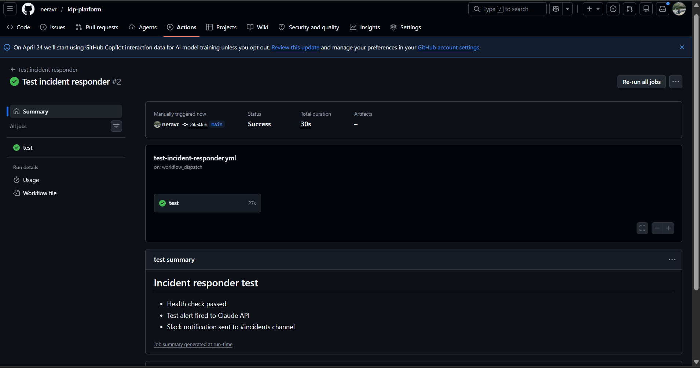
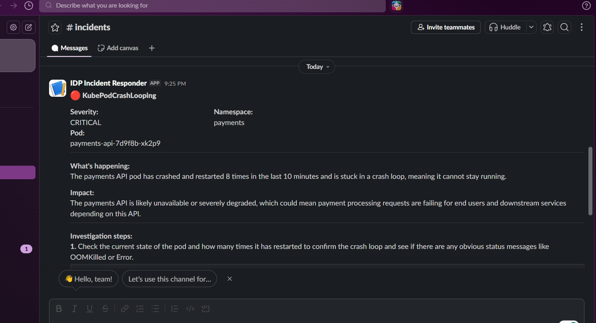

# AI Incident Responder

An AI-powered incident response system built on top of the IDP Platform. When Prometheus fires an alert, instead of your team receiving a raw notification full of labels and metric names, they get a plain English explanation of what's wrong, why it matters, and exactly what to run to investigate.

Built with FastAPI, the Anthropic Claude API, and Slack.

---

## The problem this solves

A typical Prometheus alert looks like this:

```
[FIRING:1] KubePodCrashLooping (critical/payments/payments-api-7d9f8b-xk2p9)
```

That tells an experienced engineer something. It tells a developer who just got paged at 2am almost nothing. They still have to know which namespace to look in, which kubectl commands to run, and what the most likely causes are.

This system turns that alert into:

> "The payments API pod has crashed and restarted 8 times in the last 10 minutes and is stuck in a crash loop, meaning it cannot stay running. Payment processing will be unavailable until this is resolved. Here are 5 steps to investigate, starting with checking the pod logs."

---

## How it works

```
Prometheus detects an issue
         ↓
AlertManager fires a webhook
         ↓
FastAPI webhook receiver (this service)
         ↓
Claude API analyzes the alert
  - What is happening (plain English)
  - What is the impact
  - 4-5 investigation steps with exact kubectl commands
         ↓
Formatted Slack message to #incidents
```

---

## Example output

Given a `KubePodCrashLooping` alert for the payments namespace, Claude responds with:

**What's happening:** The payments API pod has crashed and restarted 8 times in the last 10 minutes and is stuck in a crash loop, meaning it cannot stay running.

**Impact:** Payment processing is unavailable. All API requests to the payments service are failing.

**Investigation steps:**
1. Check pod logs for the crash reason
   ```
   kubectl logs payments-api-7d9f8b-xk2p9 -n payments --previous
   ```
2. Check recent events for OOM kills or probe failures
   ```
   kubectl describe pod payments-api-7d9f8b-xk2p9 -n payments
   ```
3. Check if Vault agent injected secrets correctly
   ```
   kubectl logs payments-api-7d9f8b-xk2p9 -n payments -c vault-agent
   ```
4. Check ArgoCD sync status for recent config changes
   ```
   kubectl get application -n argocd | grep payments
   ```
5. Check node memory pressure
   ```
   kubectl top nodes
   ```

---

## Tech stack

| Component | Technology |
|-----------|-----------|
| Webhook receiver | FastAPI + uvicorn |
| AI analysis | Claude API (claude-sonnet) |
| Notification | Slack Incoming Webhooks |
| Alert source | Prometheus AlertManager |
| Deployment | Kubernetes (AKS) |

---

## Supported alert types

| Alert | What Claude explains |
|-------|---------------------|
| `KubePodCrashLooping` | Pod restart cause, OOM vs probe vs config |
| `KubePodNotReady` | Health check failures, readiness probe issues |
| `KubeDeploymentReplicasMismatch` | Node pressure, scheduling failures |
| `KubeNodeNotReady` | Node health, workload eviction risk |
| `KubeMemoryOvercommit` | OOM risk, which workloads to rightsize |
| `KubeCPUOvercommit` | Throttling risk, resource limit recommendations |
| `TargetDown` | Unreachable scrape target, service connectivity |

---

## File structure

```
incident-responder/
├── main.py             # FastAPI app — webhook receiver + test endpoint
├── claude_handler.py   # Claude API integration + alert parsing
├── slack_notifier.py   # Slack message formatter + sender
├── system_prompt.py    # Platform knowledge encoded for Claude
├── requirements.txt
└── Dockerfile
```

---

## Running locally

```bash
cd incident-responder

pip install -r requirements.txt

export ANTHROPIC_API_KEY=sk-ant-...
export SLACK_WEBHOOK_URL=https://hooks.slack.com/services/...

uvicorn main:app --host 0.0.0.0 --port 8080
```

**Test the pipeline:**
```bash
curl -X POST http://localhost:8080/test
```

This fires a fake `KubePodCrashLooping` alert, calls Claude, and sends a Slack notification. Check your `#incidents` channel.

**Send a real AlertManager payload:**
```bash
curl -X POST http://localhost:8080/webhook \
  -H "Content-Type: application/json" \
  -d '{
    "alerts": [{
      "status": "firing",
      "labels": {
        "alertname": "KubePodCrashLooping",
        "severity": "critical",
        "namespace": "payments",
        "pod": "payments-api-abc123"
      },
      "annotations": {
        "summary": "Pod is crash looping",
        "description": "Pod has restarted 5 times in 10 minutes"
      },
      "startsAt": "2026-04-26T10:00:00Z"
    }]
  }'
```

---

## Deploying to AKS

**1. Create Kubernetes secret:**
```bash
kubectl create secret generic incident-responder-secrets \
  --from-literal=anthropic-api-key=sk-ant-... \
  --from-literal=slack-webhook-url=https://hooks.slack.com/... \
  -n monitoring
```

**2. Build and push image to ACR:**
```bash
az acr build \
  --registry YOUR_ACR_NAME \
  --image incident-responder:latest \
  incident-responder/
```

**3. Apply manifests:**
```bash
kubectl apply -f manifests/incident-responder/
```

**4. Configure AlertManager to point at the service:**

Update `alertmanager/config.yaml` — the webhook URL is already set to:
```
http://incident-responder.monitoring.svc.cluster.local/webhook
```

---

## What I'd add next

- Multi-channel routing — critical alerts to #incidents, warnings to #alerts
- Runbook links — Claude suggests the relevant internal runbook based on alert type
- Auto-remediation — for known safe fixes like restarting a stuck pod, Claude triggers the fix automatically after confirmation
- Alert deduplication — suppress repeat Slack messages for the same firing alert
- Metrics — track how many alerts fired, average time to resolution, most common alert types

---

## Screenshots



